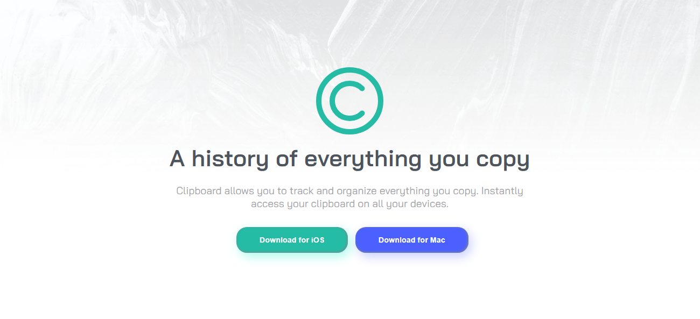
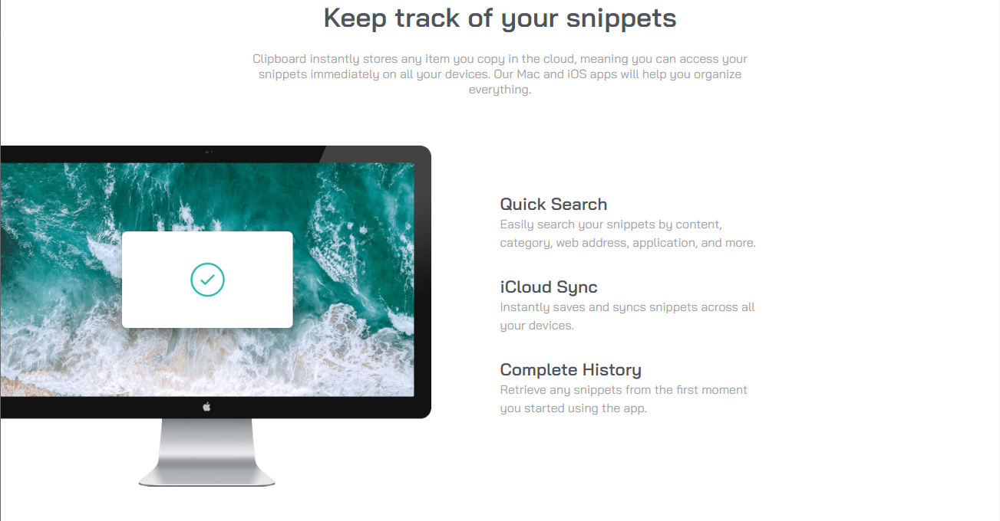
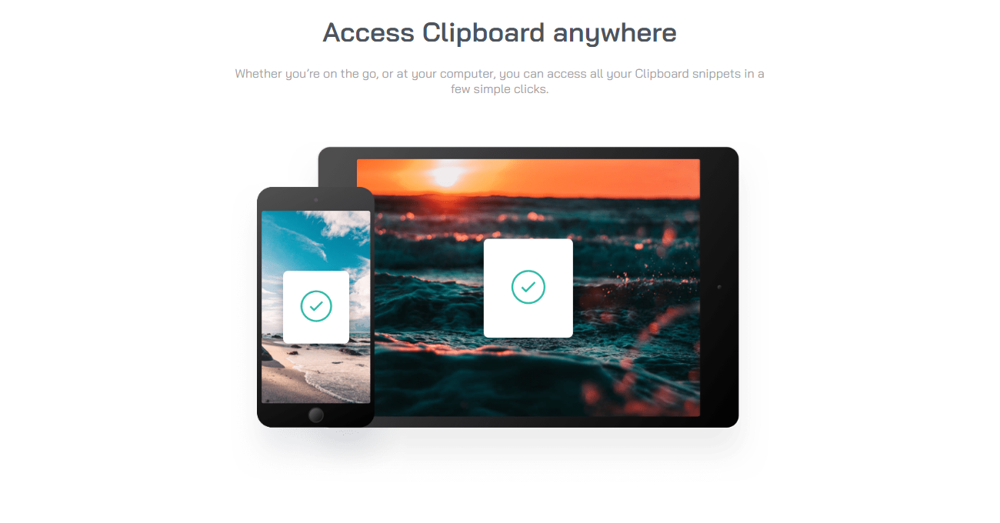

# Frontend Mentor - Clipboard landing page solution

  

This is a solution to the [Clipboard landing page challenge on Frontend Mentor](https://www.frontendmentor.io/challenges/clipboard-landing-page-5cc9bccd6c4c91111378ecb9). Frontend Mentor challenges help us to improve our coding skills by building realistic projects.

## Built with

- Semantic HTML5 markup
- CSS custom properties
- Flexbox
- CSS Grid
- Mobile-first workflow

Preview it here - [Clipboard landing page solution](https://id-dev3.github.io/Clipboard-landing-page/)   

## Author

- Website - [Idris](https://id-dev3.github.io/)
- Frontend Mentor - [@BlackFury117](https://www.frontendmentor.io/profile/BlackFury117)
- Twitter - [@id_dev3](https://www.twitter.com/id_dev3)